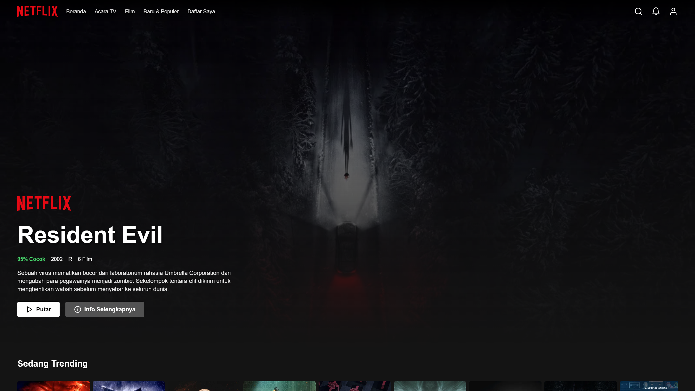
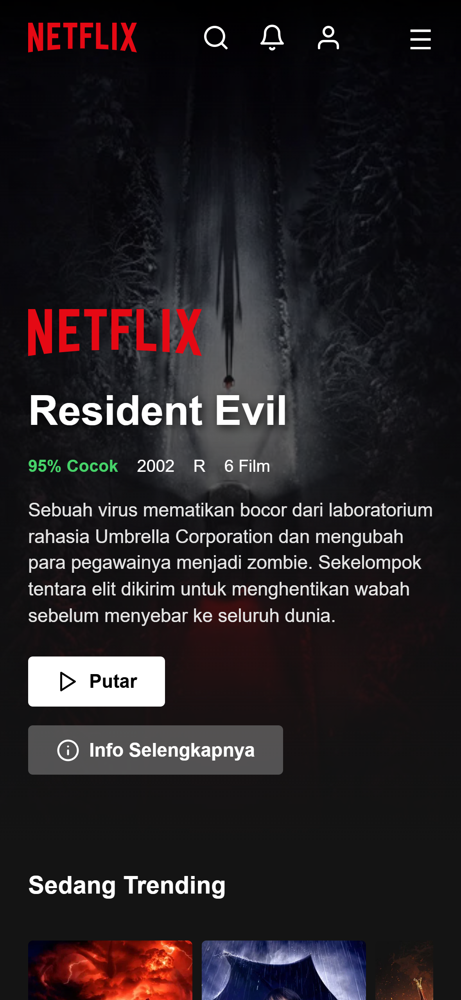

# Netflix Clone
Proyek slicing website Netflix yang dibuat untuk memenuhi tugas Praktikum mata kuliah Pemrograman Berbasis Website. Website ini merupakan replika halaman utama Netflix yang menampilkan banner film utama, daftar poster film populer, serta navigasi yang responsif di berbagai ukuran layar.

## Tentang Website
Netflix Clone ini adalah website statis satu halaman (single-page) yang meniru tampilan halaman beranda Netflix. Website ini dibuat murni menggunakan HTML, CSS, dan JavaScript tanpa bantuan framework apapun. Halaman ini menampilkan film Resident Evil sebagai banner utama, dilengkapi dengan informasi seperti persentase kecocokan, tahun rilis, rating, jumlah film, serta sinopsis dalam Bahasa Indonesia. Di bawahnya terdapat empat baris daftar poster film yang bisa digeser secara horizontal, yaitu "Sedang Trending", "Populer di Netflix", "Rilis Baru", dan "Daftar Saya".

## Fitur
- Responsive Design: Tampilan menyesuaikan otomatis di mobile, tablet, dan desktop
- Navigasi Smooth Scroll: Klik menu langsung meluncur ke section yang dituju
- Hamburger Menu: Menu navigasi berubah jadi tombol garis tiga di tampilan mobile
- Navbar Dinamis: Navbar berubah warna menjadi solid saat halaman di-scroll
- Poster Film Dinamis: Daftar poster di-generate otomatis oleh JavaScript dari sebuah array
- Efek Hover Poster: Poster membesar dan menampilkan judul film saat kursor diarahkan
- Horizontal Scroll: Deretan poster bisa digeser ke samping seperti di Netflix asli

## Teknologi yang Digunakan
- HTML5: Struktur halaman web
- CSS3: Styling, layout Flexbox, dan media queries untuk responsive
- JavaScript: Manipulasi DOM menggunakan createElement dan addEventListener

## Struktur Folder
```text
Slicing Website/
├── index.html
├── style.css
├── script.js
└── assets/
    ├── netflix-logo.svg
    ├── film-background.jpg
    ├── icon-search.svg
    ├── icon-bell.svg
    ├── icon-play.svg
    ├── icon-info.svg
    ├── avatar.svg
    ├── poster-1.jpg sampai poster-10.jpg
    ├── screenshot-desktop.png
    └── screenshot-mobile.png
```

## Screenshot
### Tampilan Desktop


### Tampilan Mobile


## Penerapan JavaScript (DOM)
Manipulasi DOM diterapkan pada bagian daftar poster film. Alih-alih menulis 10 poster secara manual di HTML, JavaScript mengambil data dari sebuah array bernama movies, lalu membuat elemen poster baru menggunakan document.createElement(), dan menyisipkannya ke dalam container menggunakan appendChild(). Hal ini membuat kode lebih ringkas dan mudah diubah. Cukup menambah atau mengubah data di array, maka poster akan otomatis diperbarui di halaman.

Fitur JavaScript lainnya:
- Toggle hamburger menu dengan classList.toggle()
- Deteksi scroll untuk mengubah warna navbar dengan window.addEventListener('scroll')
- Interaksi klik pada tombol Play dan Info menggunakan alert()

## Author
Nama: Rizal Lazuardi
NIM : 252410103045
